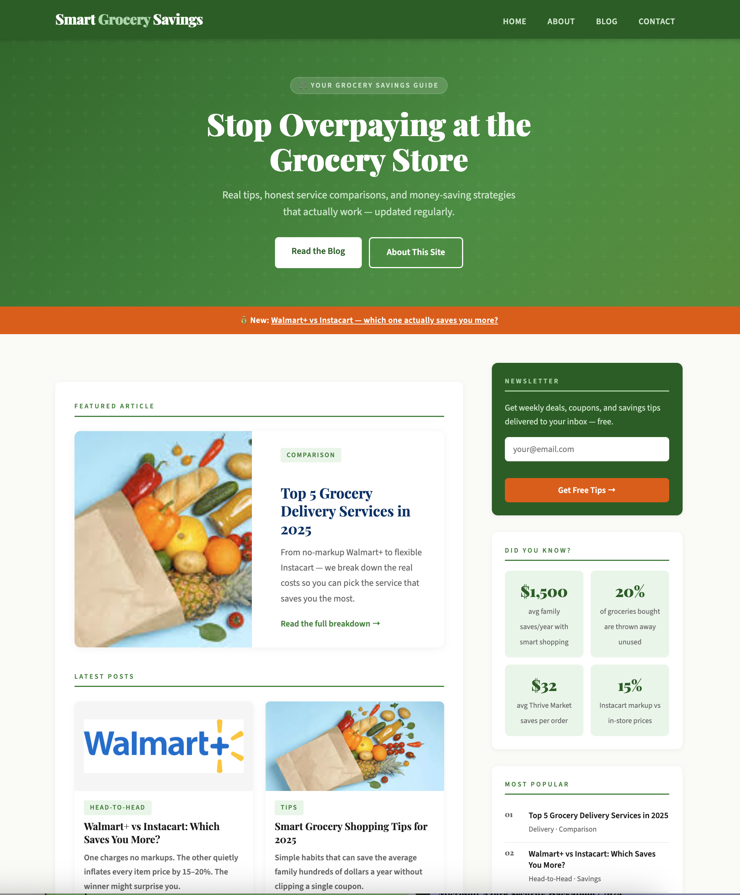
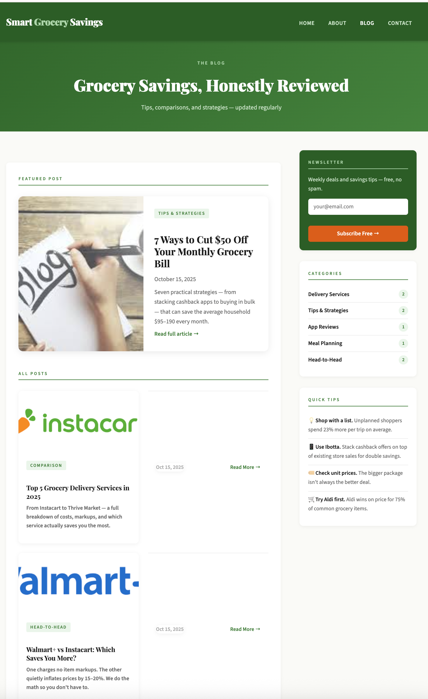
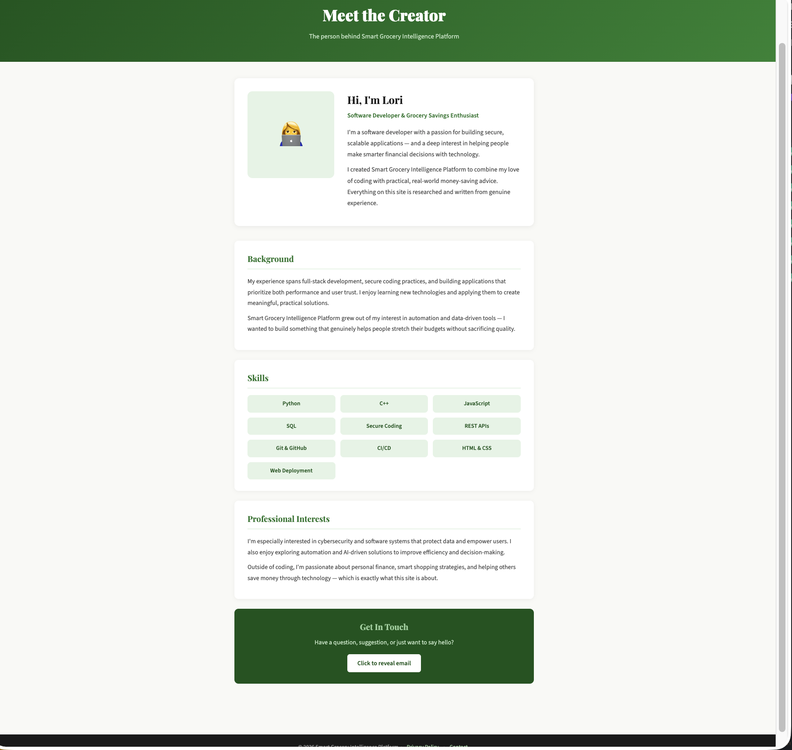
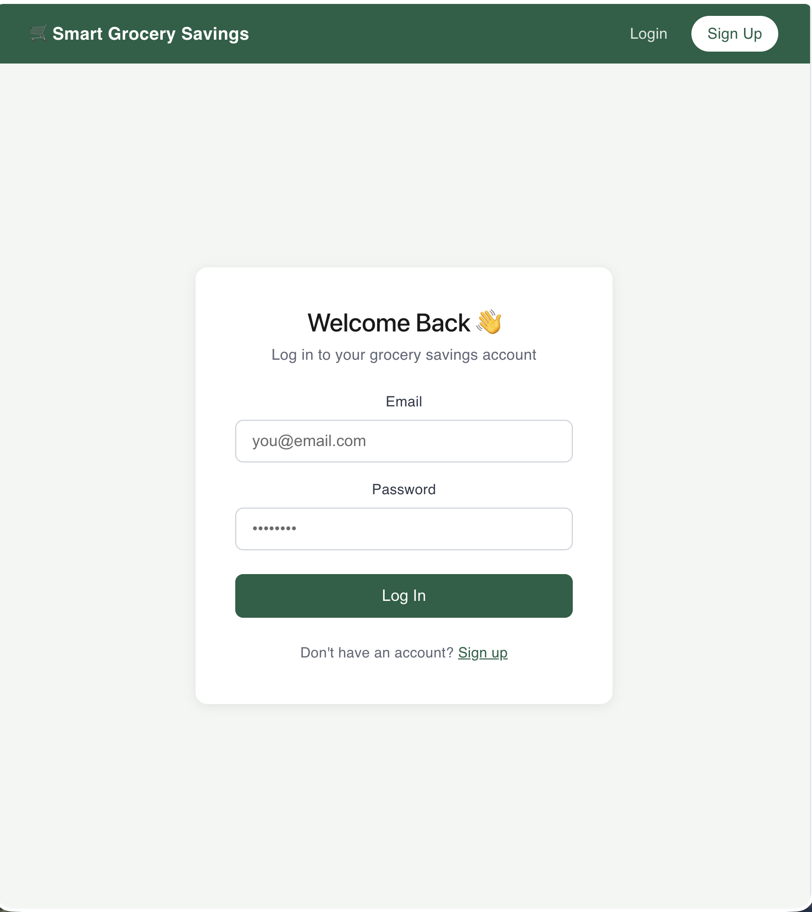
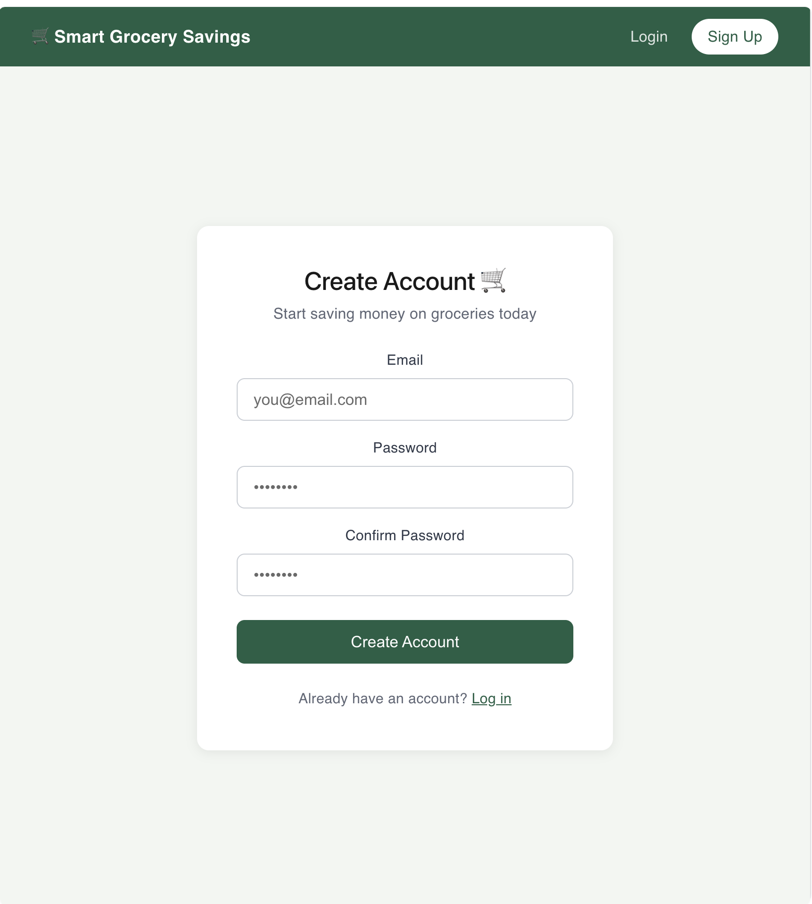
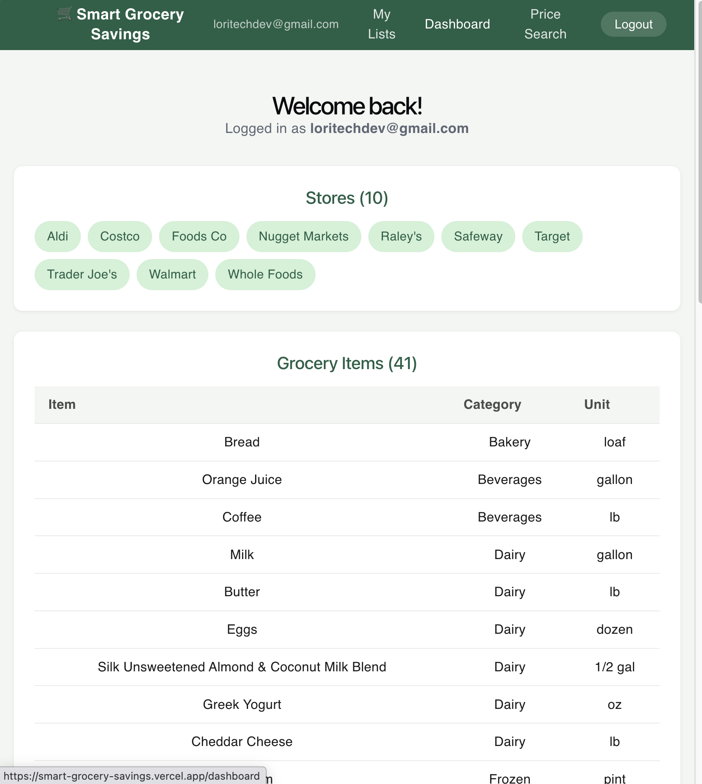
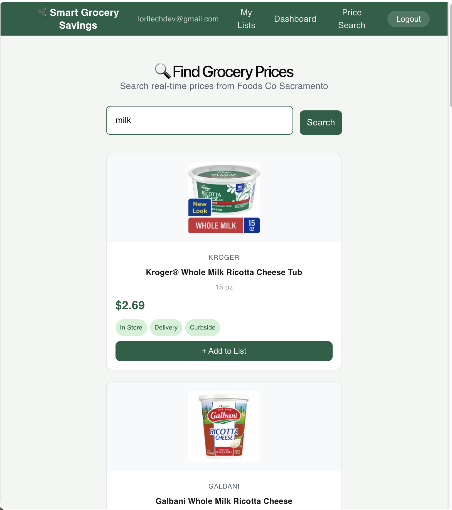
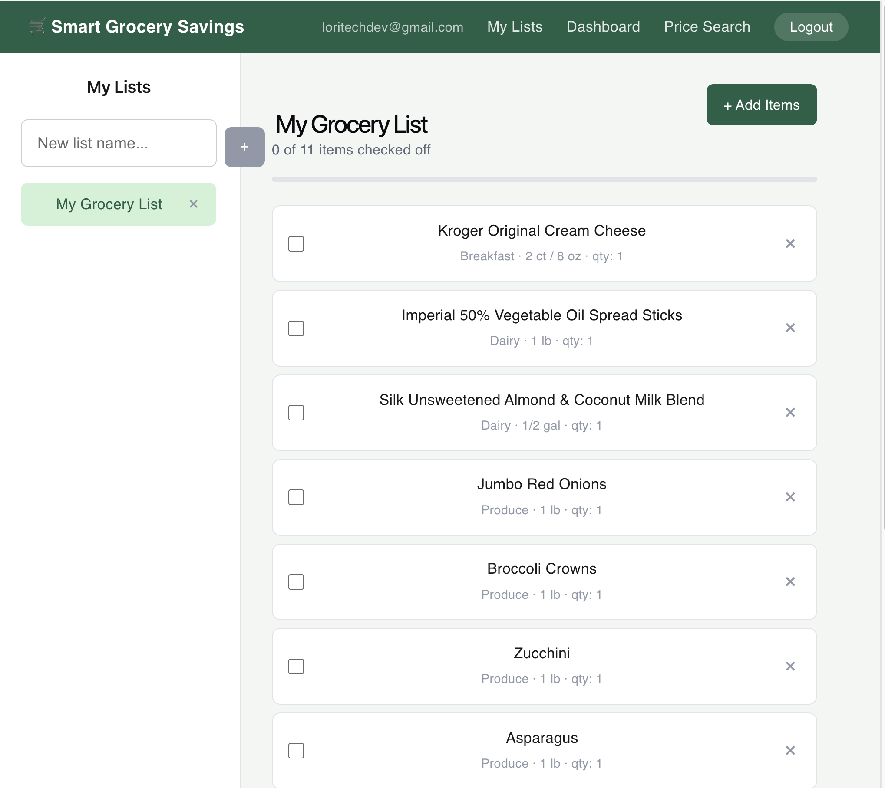

# 🛒 Smart Grocery Intelligence Platform

[](https://www.smartgrocerysavings.com)
[](https://smart-grocery-savings.vercel.app)
[]()

> A full-stack grocery cost optimization platform — built from a static content site into a real application with a PostgreSQL database, a serverless API, Supabase authentication, and a real-time price comparison engine.

---

## 🎯 What It Does

Smart Grocery Intelligence Platform helps users **find the cheapest store combination** for their grocery list. Users build a list, the platform queries real-time prices across 8+ stores, and returns the optimal shopping strategy — single store or split across multiple stores for maximum savings.

**Key features:**

- 🔍 Real-time grocery price comparison across 8 stores
- 📋 Grocery list builder with cost optimization
- 🙋 Crowdsourced pricing for stores without an official API (Safeway, Trader Joe's, Costco, etc.)
- 💬 Comments on all 12 blog posts, backed by Supabase
- 👤 User accounts via Supabase Auth
- 📰 12 published SEO-optimized editorial posts driving organic traffic

---

## 📸 Screenshots

### Static Content Site


_Magazine-style homepage with featured articles and savings tips_


_Blog listing page with 12 published posts_


_About page_

### React Application


_User authentication — login page_


_Account creation — signup page_


_User dashboard showing stores and grocery items_


_Real-time price search powered by Kroger API_


_Grocery list builder with progress tracking_

---

## 🏗️ Architecture

┌─────────────────────────────────────────────────────────┐
│ Static Blog (GitHub Pages) │
│ smartgrocerysavings.com — 12 posts + comments │
└────────────────────────┬────────────────────────────────┘
│ fetch() to Vercel functions
┌────────────────────────▼────────────────────────────────┐
│ React App + Serverless API (Vercel) │
│ frontend/ — Vite + React │
│ │
│ frontend/api/kroger-search.js frontend/api/kroger-token.js │
│ frontend/api/kroger-locations.js frontend/api/walmart-search.js│
│ frontend/api/community-prices.js frontend/api/comments/[slug].js│
└────────────────────────┬────────────────────────────────┘
│ @supabase/supabase-js
┌────────────────────────▼────────────────────────────────┐
│ Supabase (PostgreSQL + Auth) │
│ stores · items · prices · grocery_lists · list_items │
│ community_prices · comments · auth.users │
└─────────────────────────────────────────────────────────┘

---

## 🛠️ Tech Stack

### Frontend

| Technology            | Purpose                                      |
| --------------------- | -------------------------------------------- |
| HTML5 / CSS3          | Responsive magazine-style layout             |
| Vanilla JavaScript    | Dynamic components, form handling            |
| React _(in progress)_ | Full app UI rewrite                          |
| CSS Grid + Flexbox    | Responsive layouts                           |
| Google Fonts          | Typography (Playfair Display, Source Sans 3) |

### Backend

| Technology                  | Purpose                                           |
| --------------------------- | ------------------------------------------------- |
| Vercel Serverless Functions | API endpoints (`frontend/api/*.js`)               |
| @supabase/supabase-js       | Database queries + auth from serverless functions |
| Supabase Auth               | User accounts, session handling (no custom JWT)   |
| Row Level Security (RLS)    | Per-table access control, enforced in Postgres    |

### Infrastructure

| Technology            | Purpose                                                          |
| --------------------- | ---------------------------------------------------------------- |
| GitHub Pages          | Hosts the static blog/marketing site (`smartgrocerysavings.com`) |
| Vercel                | Hosts the `frontend/` React app + its serverless API functions   |
| Supabase (PostgreSQL) | Database + auth + row-level security, shared by both projects    |
| Namecheap             | Custom domain + DNS configuration                                |

---

## 📁 Project Structure

grocery-intelligence-platform/
│
├── 📄 Static Site (live at smartgrocerysavings.com)
│ ├── index.html # Magazine-style homepage
│ ├── blog.html # Blog listing (12 posts)
│ ├── about.html / contact.html / privacy.html
│ ├── header.html # Shared component (JS fetch include)
│ ├── post_1.html → post_12.html
│ ├── robots.txt + sitemap.xml
│ └── css/ + images/
│
└── ⚙️ frontend/ (React + Vite, separate Vercel project)
├── src/ # React app source
├── api/ # Vercel serverless functions
│ ├── kroger-search.js
│ ├── kroger-token.js
│ ├── kroger-locations.js
│ ├── walmart-search.js
│ ├── community-prices.js # Crowdsourced price submissions
│ └── comments/
│ └── [slug].js # Blog comment API (GET/POST)
└── vite.config.js

---

## 🗄️ Database Schema

7 tables, plus Supabase's built-in `auth.users` for authentication:

```sql
stores             -- grocery chains with location data
items              -- grocery items with category + unit
prices             -- current price per item per store
grocery_lists      -- user-owned lists (references auth.users)
list_items         -- items in each list, with quantity + checked state
community_prices   -- crowdsourced prices for stores with no official API
                   -- (Safeway, Trader Joe's, Costco, Sprouts, etc.)
comments           -- blog post comments (post_slug, author_name, body, status)
```

All tables use Row Level Security. Most allow public read; writes generally
require an authenticated Supabase session, except `comments`, which allows
public inserts since blog comments don't require an account.

---

## 🔌 API Endpoints

All endpoints are Vercel serverless functions in `frontend/api/`.

### Pricing

GET /api/kroger-search Search live Kroger prices
GET /api/kroger-locations Find nearby Kroger store locations
POST /api/kroger-token Refresh Kroger API OAuth token
GET /api/walmart-search Search live Walmart prices

### Community Prices

GET /api/community-prices?item=apples&store=safeway&zip=95814
Returns recent crowdsourced prices for stores with no official API

POST /api/community-prices
body: { item_name, store_name, price, unit, zip_code, user_id? }
Submits a new price (requires an authenticated Supabase session)

### Blog Comments

GET /api/comments/:slug Approved comments for a post (post_1 – post_12)
POST /api/comments/:slug Submit a new comment — no login required
body: { author_name, body }

---

## ✨ Engineering Highlights

- **Community pricing** — `community_prices` lets users submit prices for stores with no official API, with per-day submission limits and Row Level Security scoping writes to authenticated users
- **Blog comments** — a dependency-free, self-contained widget (`js/comments-widget.js`) posts to a Vercel serverless function on a separate project (since the blog itself runs on GitHub Pages, which can't run server code), secured with CORS + a public-insert RLS policy
- **Supabase Auth + RLS** — session-based authentication with per-table Row Level Security policies instead of a custom JWT layer
- **Shared header component** — single `header.html` file loaded via `fetch()` across all pages — update once, reflects everywhere
- **CI/CD pipeline** — GitHub Pages auto-deploys the static blog on every push to `main`; Vercel auto-deploys `frontend/` independently — no custom GitHub Actions workflow needed for either
- **SEO architecture** — `robots.txt`, `sitemap.xml` with all 12 posts, meta descriptions, structured content
- **FTC compliant** — affiliate disclosure on all monetized content per FTC guidelines

---

## 🚀 Running Locally

```bash
# Clone
git clone https://github.com/hashtags2023/grocery-intelligence-platform.git
cd grocery-intelligence-platform

# Static blog — just open the HTML files directly, or serve locally:
npx serve .

# React app + serverless API
cd frontend
npm install
# Add VITE_SUPABASE_URL, VITE_SUPABASE_ANON_KEY, KROGER_CLIENT_ID,
# KROGER_CLIENT_SECRET, VITE_MIXPANEL_TOKEN to a local .env

vercel dev          # runs the React app + api/ functions together

# Test an endpoint
curl http://localhost:3000/api/comments/post_1
```

---

## 📊 Content & SEO

12 published posts with 800–2,000+ words each, targeting high-intent grocery search queries:

| Post    | Topic                           | Target Keywords                  |
| ------- | ------------------------------- | -------------------------------- |
| post_1  | Top 5 Grocery Delivery Services | grocery delivery comparison 2026 |
| post_2  | Walmart+ vs Instacart           | walmart plus vs instacart        |
| post_6  | Aldi vs Walmart                 | aldi vs walmart cheaper          |
| post_9  | How to Save at Costco           | costco savings tips              |
| post_10 | Amazon Fresh Closing            | amazon fresh stores closed 2026  |
| post_11 | Cheapest Avocados               | cheapest avocados grocery store  |
| post_12 | Less Microplastics              | food with less microplastics     |

---

## 💰 Monetization

| Channel                   | Status            |
| ------------------------- | ----------------- |
| Amazon Associates         | ✅ Active         |
| Google AdSense            | 🔄 Pending review |
| Thrive Market Affiliate   | 🔄 In review      |
| Instacart (Impact.com)    | 🔄 In review      |
| HelloFresh (CJ Affiliate) | 🔄 Submitted      |

---

## 🔒 Security

- HTTPS enforced (GitHub Pages + Vercel SSL)
- Content Security Policy meta tags
- Environment variables for all secrets — never committed to repo
- Manual input validation in each serverless function (type checks, length limits, format checks)
- Row Level Security enforced in Postgres on every table

---

## 📬 Contact

**Website:** [smartgrocerysavings.com](https://www.smartgrocerysavings.com)
**Price Tool:** [smart-grocery-savings.vercel.app](https://smart-grocery-savings.vercel.app)
**Contact:** [smartgrocerysavings.com/contact.html](https://www.smartgrocerysavings.com/contact.html)

---

_Built by Lori — software developer. Grew from a static HTML/CSS site to a full-stack platform with PostgreSQL, Supabase Auth, and a real-time price comparison engine._
